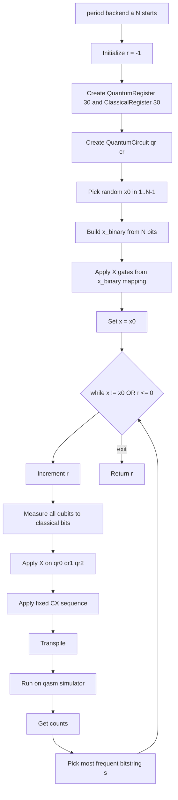

# Period Function Code Flow

This diagram maps the `period()` implementation steps, including circuit creation, iterative gate append, transpilation, backend job execution, and counts extraction.

```mermaid
flowchart TD
  A[period backend a N starts] --> B[Initialize r = -1]
  B --> C[Create QuantumRegister 30 and ClassicalRegister 30]
  C --> D[Create QuantumCircuit qr cr]
  D --> E[Pick random x0 in 1..N-1]
  E --> F[Build x_binary from N bits]
  F --> G[Apply X gates from x_binary mapping]
  G --> H[Set x = x0]

  H --> I{while x != x0 OR r <= 0}
  I --> J[Increment r]
  J --> K[Measure all qubits to classical bits]
  K --> L[Apply X on qr0 qr1 qr2]
  L --> M[Apply fixed CX sequence]
  M --> N[Transpile]
  N --> O[Run on qasm simulator]
  O --> P[Get counts]
  P --> Q[Pick most frequent bitstring s]
  Q --> I

  I -->|exit| R[Return r]
```